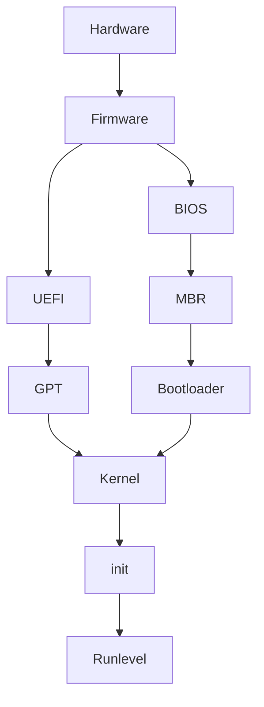

![[TUX.png|500]]

## Firmware

Dans un système informatique, un firmware (ou micrologiciel, microcode, logiciel interne ou encore logiciel embarqué) est un programme intégré dans un matériel informatique ordinateur, photocopieur, automate (disque dur, routeur, appareil photo numérique, etc.) pour qu'il puisse fonctionner.

### Différence UEFI et BIOS

## BIOS

![[BIOS.jpg|400]]

Le **BIOS (Basic Input Output System)** est en quelque sorte le centre de contrôle de la carte mère. Effectue des opérations élémentaires lors de sa mise sous tension :
-   Exécute des opérations de vérification de l'intégrité du système.
-   Cherche, charge et exécute le programme d'amorçage.
-   Il cherche le programme d'amorçage sur un disque dur, une disquette, un CD-Rom ou une clé USB.
-   Une fois le programme d'amorçage trouvé et chargé en mémoire, le BIOS lui donne le contrôle.
-   Simplement, le BIOS exécute le MBR.

Sur les cartes récentes il est remplacé par sa version moderne l'[[Démarrage Système#UEFI|UEFI]].

Il est situé sur la [[Carte Mère|carte mère]] dans plusieurs types de mémoires différentes : 
- une partie dans une [[Mémoire#Mémoire mortes|mémoire morte]] ROM (Read Only Memory), cette partie est non modifiable (il s'agit du boot block). 
- La deuxième partie du BIOS se situe dans une mémoire dont le contenu est modifiable (l'[[Mémoire#EEPROM (Electrically Erasable Programmable Read-Only Memory)|EEPROM]]). 
- La troisième partie du BIOS se situe dans la mémoire CMOS, cette mémoire contient tous les paramètres du BIOS. Effacer cette mémoire est sans danger (lorsque l'on enlève la pile de la carte mère, on efface la mémoire CMOS), mais tous les paramètres du BIOS devront être reconfigurés.

## MBR

Le **MBR** (Master Boot Record ou zone amorce) est le premier [[Mémoire#Secteur|secteur]] adressable d’un disque dur (cylindre 0, tête 0 et secteur 1, ou secteur 0 en adressage logique) dans le cadre d’un partitionnement Intel.

- Avec des disques de 2To max.

C'est le premier secteur adressable d'un disque dur. Le plus souvent appelé /dev/hda ou /dev/sda.
La taille de cette zone est de 512 bits au maximum. Elle contient :  
- le programme d'amorçage se trouve dans les 446 premier bits.
- la table des partitions (les 4 partitions primaires) du disque dur sur les 64 bits suivants.
- vérification de la validité du MBR dans les 2 derniers bits. 

Il contient une routine d'amorçage dont le but est de charger le système d'exploitation (ou le boot loader/chargeur d'amorçage s'il existe - GRUB ou LiLo) présent sur la partition active.

Simplement, le MBR exécute le programme d'amorçage GRUB.

Si le disque de boot a plusieurs partitions, le micrologiciel BIOS lit le MBR du disque, puis le VBR de la partition (Volume Boot Record). À partir de ces informations, il peut déterminer l'emplacement du chargeur d'amorçage et le lancer.

En MBR -> 4 partitions max

## Bootloader

Un Bootloader est un logiciel permettant de lancer un ou plusieurs OS, c'est-à-dire qu'il permet d'utiliser plusieurs systèmes, à des moments différents, sur la même machine. Il s'exécute à la mise sous tension de l'ordinateur, après les séquences de contrôle interne et avant le système d'exploitation, puisque son rôle est justement d'en organiser le chargement. Lorsque l'ordinateur héberge plusieurs systèmes (on parle alors de multi-amorçage(multiboot)), il permet à l'utilisateur de choisir quel système démarrer.

### GRUB

**GNU GRUB** (GRand Unified Bootloader) est un programme d'amorçage(Bootloader). 
Il permet l'amorçage de systèmes Linux ou Windows(ainsi que d'autres systèmes moins répandus). À l'inverse de LILO, GRUB n'a pas besoin d'être réinstallé dans le MBR à chaque modification de son fichier de configuration.
Grub doit être capable de reconnaître _tous_ les systèmes de fichiers sur lesquels il pourrait être amené à démarrer. Il est pour cette raison beaucoup plus volumineux que LILO.

GRUB charge et exécute le noyau sélectionné et l'image initrd (image d'un système minimal initialisé au démarrage du système = Initial Ram Disk) (initrd.img = première image de démarrage, c'est le noyau). GRUB va chercher le /boot.

## UEFI

![[EFI.jpg|400]]

Anciennement EFI. Il s’agit d’une nouvelle norme qui remplace les anciens BIOS.
**UEFI (Unified EFI (Extensible Firmware Interface))** permet entre autre des BIOS avec des souris, des animations graphiques. Elles apportent notamment plus de sécurité contre les malwares en protégeant le boot du PC.  
Les ordinateurs EFI fonctionnent avec des disques dur partitionnées en [[Démarrage Système#GPT|GPT]].  

## GPT

Nouveau MBR.
**GPT** = GUID Partition Table. Système de table de partition (obligatoire sur UEFI). Mieux que MBR.
- Nombre de partition illimité.
- Taille max de 18 exaoctets
- Et autres avantages

### Kernel

Un noyau ou kernel gère les ressources de l’ordinateur et permet aux différents composants (matériels et logiciels) de communiquer entre eux. Il effectue les tâches suivantes :
- Monte le système de fichiers racine (« root »). Donc, relie une partition ou un périphérique à un répertoire, répertoire par lequel les données présentes sur la partition ou le périphérique sont accessibles.
- Le noyau charge et exécute le programme /sbin/init (première chose démarrer après le noyau).
- Comme le programme init est le premier programme a être exécuté par le noyau Linux, il porte le PID (ID du processus) numéro 1.
- Le initrd permet ainsi d'avoir un système minimal pouvant ensuite charger le système de fichier principal ou bien des systèmes sans disques. Il peut être instable d'avoir "en dur" dans le kernel tous les drivers de disques. Pour éviter cela, les distributions compilent un kernel minimal avec les options de bases puis chargent les modules obligatoires nécessaires contenus dans l'archive de l'initrd.

### Init

**init** = binaire fournit par systemd
Init consulte le fichier /etc/inittab pour décider quel niveau d'exécution démarrer.
Les niveaux d'exécution sont :  
- 0 - Arrêt
- 1- Mode mono-utilisateur
- 2 - Mode multi-utilisateur sans serveur applicatif
- 3 - Mode multi-utilisateur avec serveur applicatif
- 4 - Inutilisé ou X11 -> interface graphique selon la distribution
- 5 - X11 -> interface graphique selon la distribution
- 6 - Redémarrage    

Init identifie le niveau d'exécution dans le fichier /etc/inittab et l'utilise pour charger les programmes associés au niveau. En général, une distribution Linux fonctionne sur le niveau 5 ou 3.

### Runlevel

Lorsque le système Linux démarre, on aperçoit (en appuyant sur la touche ESC afin de voir la version « verbeuse » du démarrage) divers services qui sont chargés. Ce sont les programmes du niveau d'exécution sur lequel le système fonctionne qui sont chargés à partir du répertoire représentant le niveau d'exécution du système.
- Les répertoires des niveaux d’exécution sont :  
	- Run level 0 – /etc/rc.d/rc0.d/
	- Run level 1 – /etc/rc.d/rc1.d/
	- Run level 2 – /etc/rc.d/rc2.d/
	- Run level 3 – /etc/rc.d/rc3.d/
	- Run level 4 – /etc/rc.d/rc4.d/
	- Run level 5 – /etc/rc.d/rc5.d/
	- Run level 6 – /etc/rc.d/rc6.d/  

Dans ces répertoires, on retrouve des noms de programme qui commencent par la lettre S et K.
Ceux qui commencent par la lettre S sont exécutés au démarrage du système (la lettre S pour « startup » = démarrage).
Ceux qui commencent par la lettre K sont exécutés à l'arrêt du système (la lettre K pour « kill » = arrêt).
De plus, dans le nom de ces programmes, il y a un chiffre après la lettre S ou K. Ce chiffre indique l'ordre d'exécution de chaque programme lors du démarrage ou de l'arrêt du système. Par exemple, S12syslog est le 12e programme qui s'exécutera au démarrage du système.